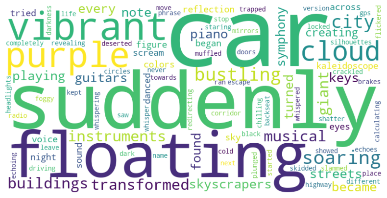
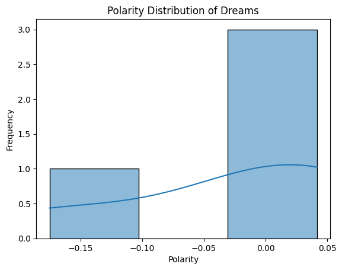
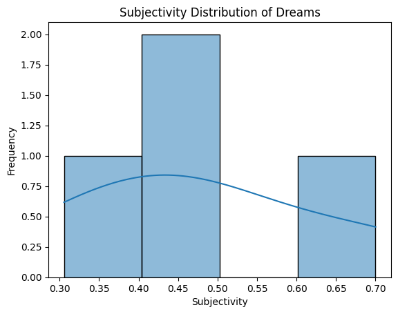
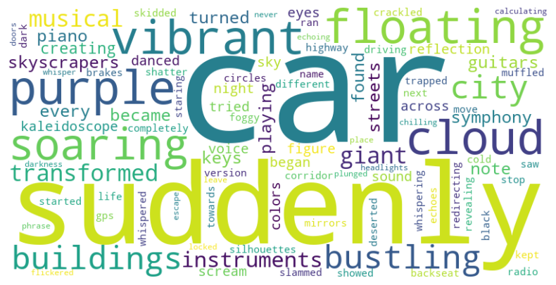

# Dream-Analysis-Project


This project is designed to analyze and interpret dreams using pre-trained sentiment models and NLP techniques. It helps users gain insights into their dream patterns, emotions, and themes by analyzing the textual descriptions of their dreams. Historical data is also leveraged to provide a comprehensive understanding of an individual's dream tendencies.

---

## **Features**
- **Dream Sentiment Analysis**: Uses VADER for sentiment classification (`Positive`, `Neutral`, `Negative`) and TextBlob for polarity and subjectivity analysis.
- **Dynamic Analysis**: Updates historical data with new entries and integrates the analysis into insights.
- **Data Visualization**:
  - **Word Cloud**: Highlights common words in dreams.
  - **Polarity Distribution**: Displays the polarity of dreams on a scale.
  - **Subjectivity Distribution**: Shows how subjective or objective the dreams are.
- **Insights from Historical Data**: Summarizes key dream patterns, such as average polarity, subjectivity, and most common themes.

---

## **Installation**

1. Clone the repository:
   ```bash
   git clone https://github.com/hemangsharma/Dream-Analysis-Project
   ```
2. Install required libraries:
   ```bash
   pip install pandas nltk matplotlib seaborn textblob wordcloud
   ```
3. Download necessary NLTK data:
   ```python
   import nltk
   nltk.download('punkt')
   nltk.download('stopwords')
   nltk.download('vader_lexicon')
   ```

---

## **Usage**

1. Run the notebook `main.ipynb`.
2. Follow the prompts to enter new dream descriptions.
3. View the analysis, including:
   - Sentiment classification (`Positive`, `Neutral`, `Negative`).
   - Polarity and subjectivity scores.
   - Word Cloud for dream themes.
   - Graphs showing polarity and subjectivity distributions.
4. Review insights from historical data if available.

---

## **Example Visualizations**

Below are examples of visualizations generated by the project:

### **1. Word Cloud**
A visualization of the most common words across all dreams:


---

### **2. Polarity Distribution**
The polarity distribution of dreams, showing whether dreams are generally positive, neutral, or negative:


---

### **3. Subjectivity Distribution**
The subjectivity distribution of dreams, indicating whether dreams are subjective (personal feelings) or objective:


---

### **4. Insights from Historical Data**
Summarized insights derived from the historical dream data, such as:
- **Average Polarity**: Measures positivity/negativity.
- **Average Subjectivity**: Measures objectivity/subjectivity.
- **Top Dream Themes**: Highlights the most common words.

---

## **Project Structure**
```
dream-analysis/
├── Dream_Analysis.ipynb     # Jupyter notebook for dream analysis
├── dream_records.csv         # CSV file storing dream data
├── README.md                 # Project documentation
└── requirements.txt          # List of required Python libraries
```

---

## **Future Enhancements**
- Add clustering for grouping dreams into themes using advanced NLP techniques.
- Incorporate user profiling for personalized insights.
- Support for multilingual dream descriptions.

---

## **License**
This project is licensed under the MIT License. See the [LICENSE](LICENSE) file for details.

---

## **Acknowledgments**
- [NLTK](https://www.nltk.org/) for sentiment analysis and preprocessing tools.
- [TextBlob](https://textblob.readthedocs.io/en/dev/) for polarity and subjectivity analysis.
- [Matplotlib](https://matplotlib.org/) and [Seaborn](https://seaborn.pydata.org/) for data visualization.
- [WordCloud](https://github.com/amueller/word_cloud) for generating word clouds.